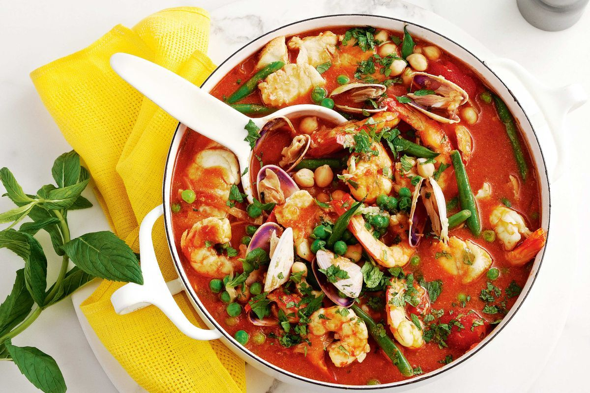

## Ingredients

- 1 tbsp vegetable oil
- 1 onion, chopped
- 1 red pepper, deseeded and chopped
- 1 garlic clove, finely chopped
- 2 tbsp harissa
- 2 x 400g cans chopped tomato
- 400g can chickpeas
- 350g bag frozen seafood selection
- 300g couscous
- small pack coriander, leaves only, roughly chopped
- 25g toasted flaked almonds
- zest and juice ½ lemon, reserving the other ½ to serve

## Method

1.  Heat the oil in a large pan and cook the onion and red pepper for about 5
    mins until softened. Stir in the garlic, harissa and chopped tomatoes, and
    cook for about 10 mins until thickened. Add the frozen seafood and cook
    through, about 10 mins more.

1.  Put the couscous in a serving bowl, pour over boiling water to cover, then
    cover with cling film. Leave to soak while the tagine cooks, then stir in
    most of the coriander, the almonds, lemon zest and juice, and seasoning.
    Serve the tagine with the couscous and cut the remaining lemon half into
    wedges to squeeze over. Sprinkle over the remaining coriander and serve.
